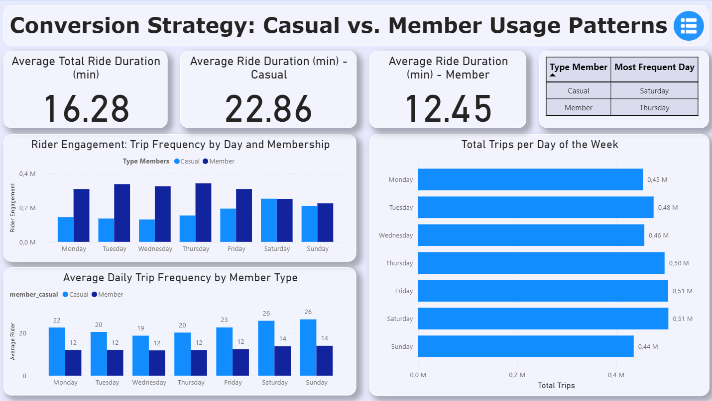

---
---
# Portuguese

---
---

# 🚴 Estudo de Caso Cyclistic: Estratégia de Conversão de Ciclistas Casuais

### Este projeto de Análise de Dados de Negócios (Case Study: Cyclistic) teve como objetivo desenvolver uma estratégia de marketing baseada em dados para a empresa fictícia de bicicletas compartilhadas Cyclistic, focada na conversão de ciclistas casuais em membros anuais. O processo seguiu as seis etapas do ciclo de análise de dados (Ask, Prepare, Process, Analyze, Share, e Act). Utilizando dados de viagens de 2025 da Divvy/Cyclistic, foram aplicadas técnicas de limpeza e engenharia de features em Python (Pandas) para criar métricas de duração e frequência. A análise revelou uma diferença fundamental no comportamento de uso: enquanto os Membros Anuais utilizam as bicicletas principalmente para transporte funcional e deslocamento (viagens curtas e nos dias úteis), os Ciclistas Casuais as utilizam para lazer e recreação (viagens longas e nos finais de semana). Esta descoberta levou a três recomendações estratégicas direcionadas à equipe de marketing, focadas em otimizar a conversão nos hotspots de lazer e comunicar a economia do uso diário.

## 1. Introdução e Tarefa de Negócios 

Este projeto é um estudo de caso prático para a empresa fictícia de bicicletas compartilhadas Cyclistic, com o objetivo de **desenvolver uma nova estratégia de marketing para converter ciclistas casuais em membros anuais**.

A diretora de marketing, Lily Moreno, identificou que o sucesso futuro da empresa depende de maximizar o número de assinaturas anuais, pois os **membros anuais são significativamente mais lucrativos** que os ciclistas casuais.

---

## 2. Perguntas Chave de Negócios

Para guiar a estratégia, a análise focou em responder as seguintes perguntas:

1.  **Como membros anuais e ciclistas casuais usam as bicicletas Cyclistic de maneiras diferentes?** *(Foco desta análise)*
2.  Por que os ciclistas casuais comprariam assinaturas anuais da Cyclistic?
3.  Como a Cyclistic pode usar a mídia digital para influenciar os ciclistas casuais a se tornarem membros?

---

## 3. Preparação dos Dados 

A análise utilizou dados históricos de viagens de bicicleta da Cyclistic, disponibilizados sob licença pela Motivate International Inc. Os dados utilizados são de **Janeiro a Outubro de 2025** (os mais atuais) e representam viagens no sistema de bicicletas compartilhadas de Chicago.

### Fontes de Dados e Estrutura

* **Fonte:** Dados mensais de viagens da Divvy Tripdata (disponíveis em [https://divvy-tripdata.s3.amazonaws.com/index.html](https://divvy-tripdata.s3.amazonaws.com/index.html)).
* **Estrutura de Colunas:** Cada arquivo CSV contém os seguintes 13 campos:
    * `ride_id` (Identificador único da viagem)
    * `rideable_type` (Tipo de bicicleta, ex: clássica, elétrica)
    * `started_at` (Data e hora de início da viagem)
    * `ended_at` (Data e hora de fim da viagem)
    * `start_station_name` (Nome da estação de início)
    * `start_station_id` (ID da estação de início)
    * `end_station_name` (Nome da estação de fim)
    * `end_station_id` (ID da estação de fim)
    * `start_lat`, `start_lng` (Latitude e Longitude de início)
    * `end_lat`, `end_lng` (Latitude e Longitude de fim)
    * `member_casual` (Tipo de cliente: "member" ou "casual")
* **Credibilidade (Critério ROCCC):** Os dados são considerados **Confidáveis** e **Completos** (rastreando fielmente as viagens). São **Originais** (diretamente da fonte), **Atuais** (2025) e **Abrangentes** (cobrem quase um ano).
* **Considerações de Privacidade:** O uso de informações de identificação pessoal (PII) é estritamente proibido, limitando a análise a padrões de uso (como as colunas acima) e não a dados demográficos pessoais.

### Entregável

O resultado desta fase é o arquivo **`cyclistic_viagens_unificadas_bruto.csv`**.

([01_cyclistic_preprocessing.ipynb](https://github.com/RaulHamad/Cyclistic_Case_Study_Coursera/blob/main/01_cyclistic_preprocessing.ipynb))

---

## 4. Limpeza e Criação de Dados Analíticos

Esta fase teve como objetivo transformar o conjunto de dados bruto (12 meses de dados unificados) em um conjunto limpo, consistente e enriquecido com métricas cruciais, preparando-o para a análise.

### Ferramentas e Metodologia

| Tarefa Principal | Ferramenta Escolhida | Justificativa |
| :--- | :--- | :--- |
| **Limpeza e Transformação** | **Python (Pandas)** | Escolhido por ser o padrão da indústria para manipulação de DataFrames. O Pandas oferece eficiência (principalmente com a sintaxe `.dt` e `groupby`) para lidar com grande quantidade de dados. |
| **Ambiente** | **Google Colab** | Utilizado para garantir reprodutibilidade, acesso em nuvem aos dados do Google Drive e escalabilidade do processamento. |

### Medidas de Integridade e Limpeza (Data Cleaning)

A integridade dos dados foi garantida pela aplicação rigorosa das seguintes regras de negócio no notebook `02_data_cleaning_and_feature_engineering.ipynb`:

 * **Tratamento de Nulos:** Todas as linhas onde faltavam informações geográficas críticas (`start_station_name`, `end_station_name`, `start_lat`, `end_lat`) foram **removidas** utilizando o método `df.dropna()`. Esta medida, embora tenha descartado aproximadamente 2 milhões de registros, foi crucial para garantir que a análise de estações e o mapeamento de *hotspots* fossem feitos apenas com dados completos e válidos.
 * **Remoção de Duplicatas:** Foi verificado e garantido que o campo `ride_id` (ID da viagem) era **único**, removendo quaisquer linhas duplicadas para evitar vieses nas contagens e médias.
 * **Filtragem de Anomalias de Tempo:** Foram removidas viagens que representavam erros de registro ou não eram representativas do uso normal do serviço:
    * Viagens com **duração inferior a 1 minuto** (anomalias de tempo curto).
    * Viagens com **duração superior a 24 horas** (indicadores de roubo ou falha grave de sistema).
*  **Verificação Categórica:** Foi assegurado que a coluna `member_casual` continha **somente** os valores válidos (`'member'` e `'casual'`).

### Engenharia de Recursos (Feature Engineering)

Para responder à pergunta de negócio, foram criados novos campos analíticos a partir dos campos de data e hora:

| Coluna Criada | Cálculo | Relevância para a Análise |
| :--- | :--- | :--- |
| **`ride_length(min)`** | `(ended_at - started_at)` / 60 | **Métrica Chave** para calcular a duração média de viagem e diferenciar o uso casual (viagens mais longas) do membro (viagens de deslocamento mais curtas). |
| **`ride_length(hours)`** | `(ended_at - started_at)` / 3600 | **Métrica Chave** Controle e Filtragem: Usado para aplicar as regras de negócio de tempo limite (ex: remover viagens > 24 horas) de forma legível. |
| **`day_of_week`** | Extraído de `started_at` | Essencial para agrupar e comparar a frequência de uso em **dias úteis (0-4)** vs. **fins de semana (5-6)**. |
| **`month`** | Extraído de `started_at` | Utilizado para identificar padrões de uso **sazonal** (ex: casuais dominam no verão). |

### Entregável

O resultado desta fase é o arquivo **`cyclistic_dados_limpos_analise.csv`**.

([02_data_cleaning_and_feature_engineering.ipynb](https://github.com/RaulHamad/Cyclistic_Case_Study_Coursera/blob/main/02_data_cleaning_and_feature_engineering.ipynb))

---

## 5. Analisar dados

Esta seção consolida as descobertas da análise estatística (realizada em Python) e a comunicação dessas descobertas através de um dashboard interativo (Power BI), respondendo à pergunta central do negócio.

A análise foi conduzida no notebook **([03_analysis_and_visualization.ipynb](https://github.com/RaulHamad/Cyclistic_Case_Study_Coursera/blob/main/03_analysis_and_visualization.ipynb))** para agregar o conjunto de dados limpo e gerar as métricas de comparação cruciais:

| Agregação Realizada | Colunas Chave | Objetivo Analítico |
| :--- | :--- | :--- |
| **Média de Viagens Total e por Membro** | `ride_length(min)`, `member_casual` | Medir a diferença de **duração** e confirmar que clientes casuais usam por períodos significativamente mais longos. |
| **Contagem de Viagens por Membro e Dia da Semana** | `day_of_week`, `member_casual` | Identificar os **picos de frequência** no ciclo semanal. Membros: dias úteis. Casuais: fins de semana. |
| **Média de Viagens por Membro e Dia da Semana** | `ride_length(min)`, `day_of_week` | Reforçar o padrão de duração por dia: Casuais pedalam por mais tempo, especialmente nos finais de semana. |
| **Top 10 Estações (Casual vs. Membro)** | `start_station_name`, `member_casual` | Identificar os **Hotspots** para cada grupo. Membros: Centros de transporte/escritórios. Casuais: Pontos turísticos. |

### Descobertas e Resposta à Pergunta de Negócio

A análise comparativa entre as duas bases de clientes (`member` e `casual`) revelou padrões de uso fundamentalmente diferentes, que podem ser explorados pelo marketing:

#### Resposta à Pergunta de Negócio:

**Sim, membros anuais e ciclistas casuais usam as bicicletas Cyclistic de maneiras distintas.**

A principal conclusão é que **Membros buscam transporte (deslocamento)**, e **Casuais buscam lazer e recreação**.

| Métrica | Clientes Membros (Anuais) | Clientes Casuais | Conclusão |
| :--- | :--- | :--- | :--- |
| **Duração Média da Viagem** | Curta e Consistente (Uso funcional) | Longa e Variável (Uso recreativo) | O foco do marketing para casuais deve ser converter o **uso longo e esporádico** em **uso diário**. |
| **Pico de Uso** | **Dias Úteis** (Segunda a Sexta) | **Finais de Semana** (Sábado e Domingo) | Membros usam a bicicleta para o **deslocamento** (trabalho/casa). Casuais usam nos dias de **lazer**. |
| **Local de Partida (Top 10)** | Estações próximas a **áreas comerciais e residenciais densas**. | Estações próximas a **parques, lagos e pontos turísticos**. | Os *hotspots* casuais são os locais ideais para o **marketing presencial** da associação anual. |

### Comunicação (Entregável)

As descobertas da análise foram comunicadas à Diretoria e à Equipe de Marketing por meio de um **Dashboard Interativo** no Power BI...

**Visão Geral do Dashboard (Análise de Uso)**

**Visão Geral do Dashboard (Análise de Uso)**

...
➡️ **[Acessar o Notebook de Análise Estatística (Python)]**
**([03_analysis_and_visualization.ipynb](https://github.com/RaulHamad/Cyclistic_Case_Study_Coursera/blob/main/03_analysis_and_visualization.ipynb))**

##  Principais Recomendações

Baseado nos padrões de **duração**, **frequência** e **localização** dos Casuais, as recomendações são:

---

### Recomendação 1: Campanha de Marketing Direcionada por Localização e Tempo

* **O Insight:** Ciclistas Casuais têm picos de uso nos **Finais de Semana** e se concentram em estações de lazer/turismo (parques, lagos, orla).
* **A Ação:** Implementar campanhas de **Marketing de Proximidade (Geofencing)** e **E-mail Marketing** acionadas após o término de uma viagem casual longa (acima da média dos membros, ex: 35 minutos), especialmente aos domingos. A mensagem deve focar na **vantagem de custo-benefício** de uma assinatura anual para uso semanal.
* **Métrica de Sucesso:** Aumento de **15%** nas conversões de Casuais que iniciaram viagens em estações turísticas nos fins de semana.

---

### Recomendação 2: Ofertas de Valor para o Deslocamento Diário

* **O Insight:** A principal barreira de Casuais é ver a bicicleta apenas como utilitária (para lazer). Membros usam consistentemente para deslocamento em dias de semana.
* **A Ação:** Criar um **teste de assinatura de 30 dias com desconto** ou um **Programa de Fidelidade** focado em viagens nos dias úteis. A comunicação deve enfatizar a **economia de tempo e dinheiro** no deslocamento casa-trabalho em comparação com transporte público ou carro.
* **Métrica de Sucesso:** Aumento da **frequência média semanal** de Casuais que se tornaram membros.

---

### Recomendação 3: Melhoria dos Pontos de Uso Frequente de Ciclistas Casuais

* **O Insight:** As **Top 10 Estações Casuais** são locais ideais para conversão, pois demonstram alta demanda e forte engajamento recreativo.
* **A Ação:** Implementar **"Estações de Conversão"** nos finais de semana nos *hotspots* mais movimentados. Isso inclui a presença de equipe (embaixadores da marca) para oferecer **promoções exclusivas** para assinaturas anuais (ex: teste gratuito de 30 dias na hora) e garantir **abastecimento ideal de bicicletas** nas horas de pico de lazer.
* **Métrica de Sucesso:** Aumento da **taxa de conversão no local** para 5% dos Casuais que completam viagens longas nas estações de alto volume.

---
---
# English

---
---
# 🚴 Cyclistic Case Study: Casual Rider Conversion Strategy

### This Business Data Analysis project (Case Study: Cyclistic) aimed to develop a data-driven marketing strategy for the fictional bike-share company Cyclistic, focused on converting casual riders into annual members. The process followed the six steps of the data analysis cycle (Ask, Prepare, Process, Analyze, Share, and Act). Utilizing 2025 trip data from Divvy/Cyclistic, cleaning and feature engineering techniques were applied in Python (Pandas) to create duration and frequency metrics. The analysis revealed a fundamental difference in usage behavior: while Annual Members primarily use bikes for functional transport and commuting (short trips on weekdays), Casual Riders use them for leisure and recreation (long trips on weekends). This discovery led to three strategic recommendations aimed at the marketing team, focusing on optimizing conversion at leisure hotspots and communicating the benefits of daily use.

## 1. Introduction and Business Task

This project is a practical case study for the fictional bike-share company Cyclistic, with the goal of **developing a new marketing strategy to convert casual riders into annual members**.

The Marketing Director, Lily Moreno, identified that the future success of the company depends on maximizing the number of annual subscriptions, as **annual members are significantly more profitable** than casual riders.

---

## 2. Key Business Questions

To guide the strategy, the analysis focused on answering the following questions:

1. **How do annual members and casual riders use Cyclistic bikes differently?** *(Focus of this analysis)*
2. Why would casual riders buy annual Cyclistic memberships?
3. How can Cyclistic use digital media to influence casual riders to become members?

---

## 3. Data Preparation

The analysis used historical bike trip data from Cyclistic, made available under license by Motivate International Inc. The data used is from **January to October 2025** (the most current) and represents trips within the Chicago bike-share system.

### Data Sources and Structure

* **Source:** Monthly trip data from Divvy Tripdata (available at [https://divvy-tripdata.s3.amazonaws.com/index.html](https://divvy-tripdata.s3.amazonaws.com/index.html)).
* **Column Structure:** Each CSV file contains the following 13 fields:
    * `ride_id` (Unique trip identifier)
    * `rideable_type` (Bike type, e.g., classic, electric)
    * `started_at` (Date and time of trip start)
    * `ended_at` (Date and time of trip end)
    * `start_station_name` (Name of start station)
    * `start_station_id` (ID of start station)
    * `end_station_name` (Name of end station)
    * `end_station_id` (ID of end station)
    * `start_lat`, `start_lng` (Start Latitude and Longitude)
    * `end_lat`, `end_lng` (End Latitude and Longitude)
    * `member_casual` (Customer type: "member" or "casual")
* **Credibility (ROCCC Criteria):** The data is considered **Reliable** and **Comprehensive** (faithfully tracking trips). It is **Original** (directly from the source), **Current** (2025), and **Extensive** (covering almost a year).
* **Privacy Considerations:** The use of Personally Identifiable Information (PII) is strictly prohibited, limiting the analysis to usage patterns (like the columns above) and not personal demographics.

### Deliverable

The result of this phase is the file **`cyclistic_viagens_unificadas_bruto.csv`**.

([01_cyclistic_preprocessing.ipynb](https://github.com/RaulHamad/Cyclistic_Case_Study_Coursera/blob/main/01_cyclistic_preprocessing.ipynb))

---

## 4. Data Cleaning and Analytical Data Creation

This phase aimed to transform the raw dataset (12 months of unified data) into a clean, consistent, and enriched set with crucial metrics, preparing it for analysis.

### Tools and Methodology

| Main Task | Chosen Tool | Rationale |
| :--- | :--- | :--- |
| **Cleaning and Transformation** | **Python (Pandas)** | Chosen as the industry standard for DataFrame manipulation. Pandas offers efficiency (especially with the `.dt` and `groupby` syntax) for handling large amounts of data. |
| **Environment** | **Google Colab** | Used to ensure reproducibility, cloud access to Google Drive data, and processing scalability. |

### Data Integrity and Cleaning Measures (Data Cleaning)

Data integrity was ensured by rigorously applying the following business rules in the `02_data_cleaning_and_feature_engineering.ipynb` notebook:

* **Handling Nulls:** All rows missing critical geographic information (`start_station_name`, `end_station_name`, `start_lat`, `end_lat`) were **removed** using the `df.dropna()` method. This measure, while discarding approximately 2 million records, was crucial to ensure that station analysis and hotspot mapping were done only with complete and valid data.
* **Duplicate Removal:** It was verified and ensured that the `ride_id` field (Trip ID) was **unique**, removing any duplicate rows to avoid bias in counts and averages.
* **Time Anomaly Filtering:** Trips that represented logging errors or were not representative of normal service use were removed:
    * Trips with a **duration of less than 1 minute** (short-time anomalies).
    * Trips with a **duration exceeding 24 hours** (indicators of theft or severe system failure).
* **Categorical Verification:** It was ensured that the `member_casual` column contained **only** the valid values (`'member'` and `'casual'`).

### Feature Engineering

To answer the business question, new analytical fields were created from the date and time fields:

| Created Column | Calculation | Relevance to Analysis |
| :--- | :--- | :--- |
| **`ride_length(min)`** | `(ended_at - started_at)` / 60 | **Key Metric** to calculate the average trip duration and differentiate casual use (longer trips) from member use (shorter commute trips). |
| **`ride_length(hours)`** | `(ended_at - started_at)` / 3600 | **Key Metric** Control and Filtering: Used to apply time limit business rules (e.g., removing trips > 24 hours) legibly. |
| **`day_of_week`** | Extracted from `started_at` | Essential for grouping and comparing usage frequency on **weekdays (0-4)** vs. **weekends (5-6)**. |
| **`month`** | Extracted from `started_at` | Used to identify **seasonal** usage patterns (e.g., casuals dominate in summer). |

### Deliverable

The result of this phase is the file **`cyclistic_dados_limpos_analise.csv`**.

([02_data_cleaning_and_feature_engineering.ipynb](https://github.com/RaulHamad/Cyclistic_Case_Study_Coursera/blob/main/02_data_cleaning_and_feature_engineering.ipynb))

---

## 5. Data Analysis

This section consolidates the findings from the statistical analysis (performed in Python) and the communication of these findings through an interactive dashboard (Power BI), answering the central business question.

The analysis was conducted in the notebook **([03_analysis_and_visualization.ipynb](https://github.com/RaulHamad/Cyclistic_Case_Study_Coursera/blob/main/03_analysis_and_visualization.ipynb))** to aggregate the clean dataset and generate the crucial comparison metrics:

| Aggregation Performed | Key Columns | Analytical Objective |
| :--- | :--- | :--- |
| **Average Trip Length Total and by Member** | `ride_length(min)`, `member_casual` | Measure the difference in **duration** and confirm that casual customers use the service for significantly longer periods. |
| **Trip Count by Member and Day of Week** | `day_of_week`, `member_casual` | Identify **frequency peaks** in the weekly cycle. Members: weekdays. Casuals: weekends. |
| **Average Trip Length by Member and Day of Week** | `ride_length(min)`, `day_of_week` | Reinforce the duration pattern by day: Casuals ride longer, especially on weekends. |
| **Top 10 Stations (Casual vs. Member)** | `start_station_name`, `member_casual` | Identify the **Hotspots** for each group. Members: Commuter/office centers. Casuals:

### Findings and Answer to the Business Question

The comparative analysis between the two customer bases (`member` and `casual`) revealed fundamentally different usage patterns that can be exploited by marketing:

#### Answer to the Business Question:

**Yes, annual members and casual riders use Cyclistic bikes in distinct ways.**

The main conclusion is that **Members seek transportation (commuting)**, and **Casuals seek leisure and recreation**.

| Metric | Member Customers (Annual) | Casual Customers | Conclusion |
| :--- | :--- | :--- | :--- |
| **Average Trip Duration** | Short and Consistent (Functional use) | Long and Variable (Recreational use) | Marketing for casuals should focus on converting **long, sporadic use** into **daily use**. |
| **Usage Peak** | **Weekdays** (Monday to Friday) | **Weekends** (Saturday and Sunday) | Members use the bike for **commuting** (work/home). Casuals use it for **leisure**. |
| **Starting Location (Top 10)** | Stations near **dense commercial and residential areas**. | Stations near **parks, lakes, and tourist attractions**. | Casual hotspots are the ideal locations for **in-person marketing** of the annual membership. |

### Communication (Deliverable)

The analysis findings were communicated to the Director and the Marketing Team through an **Interactive Dashboard** in Power BI...

**Dashboard Overview (Usage Analysis)**

**Dashboard Overview (Usage Analysis)**

...
➡️ **[Access Statistical Analysis Notebook (Python)]**
**([03_analysis_and_visualization.ipynb](https://github.com/RaulHamad/Cyclistic_Case_Study_Coursera/blob/main/03_analysis_and_visualization.ipynb))**

##  Key Recommendations

Based on the **duration**, **frequency**, and **location** patterns of Casual Riders, the recommendations are:

---

### Recommendation 1: Location and Time-Targeted Marketing Campaign 

* **The Insight:** Casual Riders have usage peaks on **Weekends** and concentrate at leisure/tourism stations (parks, lakes, waterfronts).
* **The Action:** Implement **Proximity Marketing (Geofencing)** and **Email Marketing** campaigns triggered after a long casual trip (above the member average, e.g., 35 minutes), especially on Sundays. The message should focus on the **cost-benefit advantage** of an annual subscription for weekday use.
* **Success Metric:** **15% increase** in conversions from Casuals who started trips at tourist stations on weekends.

---

### Recommendation 2: Value Offers for Daily Commuting ️

* **The Insight:** The main barrier for Casuals is seeing the bike only as recreational. Members use the service consistently for commuting on weekdays.
* **The Action:** Create a **discounted 30-day subscription trial** or a **Loyalty Program** focused on weekday trips. Communication should emphasize **time and money savings** on the home-to-work commute compared to public transport or cars.
* **Success Metric:** Increase in the **average weekly frequency** of Casuals who become members.

---

### Recommendation 3: Improving the Experience at Frequent Casual Use Points 

* **The Insight:** The **Top 10 Casual Stations** are ideal locations for conversion, as they demonstrate high demand and strong recreational engagement.
* **The Action:** Implement **"Conversion Stations"** on weekends at the busiest hotspots. This includes having staff presence (brand ambassadors) to offer **exclusive promotions** for annual subscriptions (e.g., immediate 30-day free trial) and ensure **optimal bike supply** during peak leisure hours.
* **Success Metric:** Increase in the **on-site conversion rate** to 5% of Casuals who complete long trips at high-volume stations.
